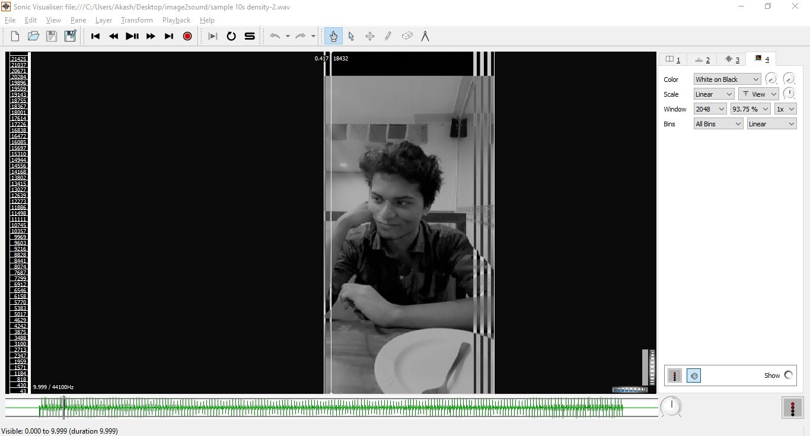

# image2sound

  
## TL;DR
---
> Converts an image to sound. Image can be recreated in spectrogram of generated sound. 

> Applications: Steganography, Encryption, Security, Communication
---
## Full Explanation
---
> Large demand of various applications requires data to be transmitted in such a manner, that it should remain secure. Data transmission in public communication system is not secure because of interception and Interruption by hackers. Steganography is a method of hiding secret data, by embedding it into an audio, video, image or text file in such a way that it is neither detectable easily nor easily extractable. It is one of the methods employed to protect secret or sensitive data from malicious attacks.

> The Idea of this program is to achieve Steganography by hiding image data inside an audio and ensure secure transfer of data. The images are first converted into audio and that audio is superimposed over another carrier audio that might be song or a voice recording. The original image cannot be extracted without knowing the original carrier audio wave which makes the transfer secure and the presence of hidden data is not detectable to a normal user in any way when listening to the modified audio.

> This project is only half way done. This only works one way right now i.e Image-> Audio
> 
> I'll complete the rest whenever I'll get time
---
# Important

Feel free to use this program and the bits and pieces of the code but **please do give credit whenever possible.**
Mention my [github](https://github.com/akashraj9828) or link this  [project](https://github.com/akashraj9828/img2sound). Thank you. 
Happy coding :')

---
## Requirement
``` 
- Java 8
- Audio analyzer with spectrogram feature (Sonic visualizer for Windows included)
```
---
## How to use
``` 
> javac img2sound.java
> java  img2sound [image name] [seconds] [Density]

    [image name] png and jpeg supported
    [seconds] Default 5, Output audio file length in seconds
    [Density] Default 4, Small numbers make image pixel narrower and sharpen. 
                But, processing takes a long time.
    [?,-h,--h,-help,help] To display this help screen
```
---
## Sample

> Download output audio file from 
> [Audio file](./output/sample_10s_density-2.wav) 
> 
> ### Input Image
> 
> 
> ### Spectrogram of Audio [Audio file](./output/sample_10s_density-2.wav)
> 


# GUI version coming soon :p